# 📊 Diagrammes de Cas d'Utilisation UML
## Portail de Facturation Moov Africa Togo

**Version :** 3.0 (Conforme règles académiques UML)  
**Date :** 06 août 2026  
**Auteur :** Benoit BANLEPO Mintre

---

## ⚠️ Règles UML appliquées

Ce document respecte les règles académiques des diagrammes de cas d'utilisation :
- ✅ Vision utilisateur (pas technique)
- ✅ Fonctionnalités essentielles uniquement
- ✅ Limites du système clairement définies
- ✅ Acteurs principaux/secondaires distingués
- ✅ Relations `<<include>>` et `<<extend>>` correctes
- ✅ Descriptions textuelles pour cas importants
- ✅ Diagrammes lisibles et non surchargés

---

## Table des matières

1. [Définition des limites du système](#1-définition-des-limites-du-système)
2. [Identification des acteurs](#2-identification-des-acteurs)
3. [Diagramme global](#3-diagramme-global)
4. [Diagrammes par acteur principal](#4-diagrammes-par-acteur-principal)
5. [Cas d'utilisation détaillés avec descriptions](#5-cas-dutilisation-détaillés-avec-descriptions)
6. [Règles UML appliquées](#6-règles-uml-appliquées)

---

## 1. Définition des limites du système

### Système : **Portail de Facturation Moov Africa Togo**

**Périmètre :**
- ✅ **Dans le système :** Gestion contrats, publication factures, consultation, notifications, gestion utilisateurs
- ❌ **Hors système :** Génération des factures par le système de billing Moov, paiement des factures, système téléphonique

**Frontières :**
```
┌─────────────────────────────────────────────┐
│   PORTAIL DE FACTURATION MOOV AFRICA        │
│                                             │
│  • Gestion des contrats entreprises        │
│  • Publication des factures PDF            │
│  • Consultation des factures               │
│  • Notifications clients                    │
│  • Administration utilisateurs              │
│                                             │
└─────────────────────────────────────────────┘
```

---

## 2. Identification des acteurs

### Acteurs humains

| Acteur | Type | Description | Responsabilités |
|--------|------|-------------|-----------------|
| **Super Admin** | Principal | Administrateur système | Configuration complète, gestion tous utilisateurs |
| **Chef Facturation** | Principal | Responsable facturation | Supervision, gestion agents, validation publications |
| **Agent Facturation** | Principal | Opérateur facturation | Publication factures, gestion contrats quotidienne |
| **Payeur** | Principal | Client entreprise | Consultation ses factures |
| **Employé** | Principal | Salarié de l'entreprise cliente | Consultation sa facture personnelle |

### Acteurs systèmes (secondaires)

| Acteur | Type | Description |
|--------|------|-------------|
| **Système Email** | Secondaire | Service SMTP Gmail |
| **Système SMS** | Secondaire | Service Vonage API |

---

## 1. Diagramme Global

### Vue d'ensemble du système

```plantuml
@startuml
left to right direction
skinparam packageStyle rectangle

actor "Super Admin" as SuperAdmin
actor "Chef Facturation" as Chef
actor "Agent Facturation" as Agent
actor "Payeur" as Payeur
actor "Employé" as Employe

rectangle "Portail de Facturation Moov Africa" {
  
  ' ========== GESTION UTILISATEURS ==========
  package "Gestion Utilisateurs" {
    usecase "Créer utilisateur" as UC1
    usecase "Modifier statut utilisateur" as UC2
    usecase "Réinitialiser mot de passe" as UC3
    usecase "Consulter logs audit" as UC4
  }

  
  ' ========== GESTION CONTRATS ==========
  package "Gestion Contrats" {
    usecase "Créer contrat" as UC5
    usecase "Modifier contrat" as UC6
    usecase "Résilier contrat" as UC7
    usecase "Ajouter ligne" as UC8
    usecase "Modifier services ligne" as UC9
    usecase "Affecter employé à ligne" as UC10
  }
  
  ' ========== GESTION FACTURATION ==========
  package "Gestion Facturation" {
    usecase "Publier factures PDF" as UC11
    usecase "Envoyer notifications" as UC12
    usecase "Consulter factures" as UC13
    usecase "Télécharger facture PDF" as UC14
    usecase "Exporter données" as UC15
    usecase "Annuler facture" as UC16
  }
  
  ' ========== GESTION TARIFS & SERVICES ==========
  package "Gestion Tarifs & Services" {
    usecase "Créer forfait" as UC17
    usecase "Modifier forfait" as UC18
    usecase "Créer service" as UC19
    usecase "Modifier service" as UC20
  }
  
  ' ========== TABLEAUX DE BORD ==========
  package "Tableaux de Bord" {
    usecase "Consulter statistiques" as UC21
    usecase "Voir rapports globaux" as UC22
    usecase "Voir mes factures" as UC23
  }
}

' ========== RELATIONS SUPER ADMIN ==========
SuperAdmin --> UC1
SuperAdmin --> UC2
SuperAdmin --> UC3
SuperAdmin --> UC4
SuperAdmin --> UC5
SuperAdmin --> UC6
SuperAdmin --> UC7
SuperAdmin --> UC11
SuperAdmin --> UC12
SuperAdmin --> UC15
SuperAdmin --> UC16
SuperAdmin --> UC17
SuperAdmin --> UC18
SuperAdmin --> UC19
SuperAdmin --> UC20
SuperAdmin --> UC21
SuperAdmin --> UC22


' ========== RELATIONS CHEF FACTURATION ==========
Chef --> UC1
Chef --> UC2
Chef --> UC3
Chef --> UC5
Chef --> UC6
Chef --> UC7
Chef --> UC8
Chef --> UC9
Chef --> UC11
Chef --> UC12
Chef --> UC15
Chef --> UC16
Chef --> UC17
Chef --> UC18
Chef --> UC19
Chef --> UC20
Chef --> UC21
Chef --> UC22
Chef --> UC4

' ========== RELATIONS AGENT FACTURATION ==========
Agent --> UC5
Agent --> UC6
Agent --> UC8
Agent --> UC9
Agent --> UC10
Agent --> UC11
Agent --> UC13
Agent --> UC14
Agent --> UC15
Agent --> UC17
Agent --> UC19
Agent --> UC21

' ========== RELATIONS PAYEUR ==========
Payeur --> UC13
Payeur --> UC14
Payeur --> UC15
Payeur --> UC23

' ========== RELATIONS EMPLOYÉ ==========
Employe --> UC13
Employe --> UC14
Employe --> UC23

@enduml
```

---


## 2. Cas d'utilisation par acteur

### 2.1 Super Admin

**Responsabilités :** Administration complète du système

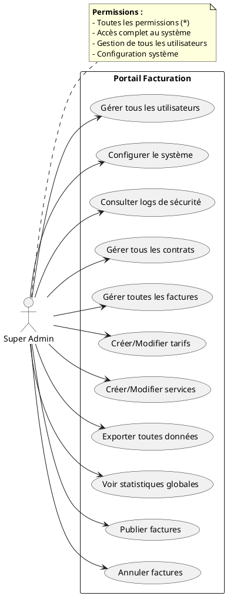

---

### 2.2 Chef Facturation

**Responsabilités :** Gestion des agents et supervision facturation

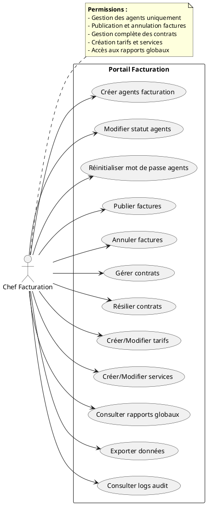

---


### 2.3 Agent Facturation

**Responsabilités :** Opérations de facturation quotidiennes

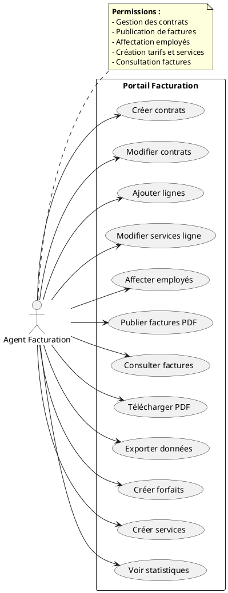

---

### 2.4 Payeur

**Responsabilités :** Consultation et gestion de ses factures

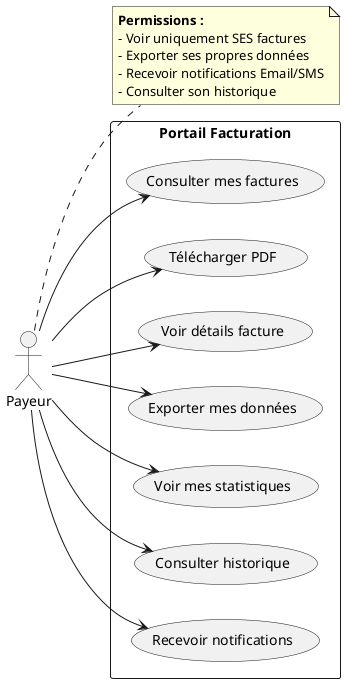

---


### 2.5 Employé

**Responsabilités :** Consultation de sa propre facture

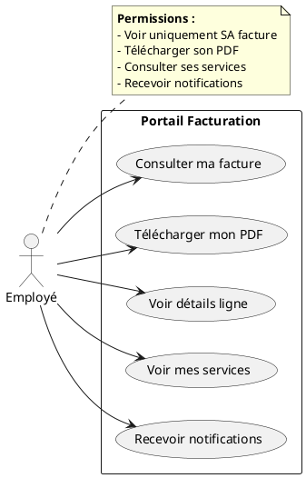

---

## 3. Cas d'utilisation principaux détaillés

### 3.1 Publier des factures

**Description :** Publication de factures à partir de PDF téléchargés

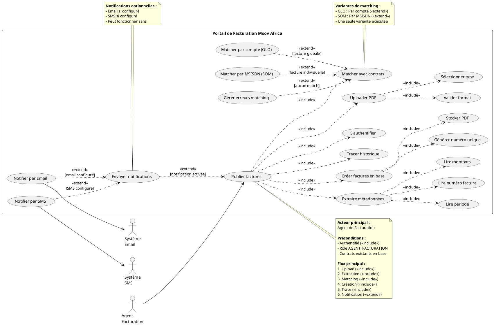

---


### 3.2 Gérer les contrats

**Description :** Gestion complète du cycle de vie d'un contrat

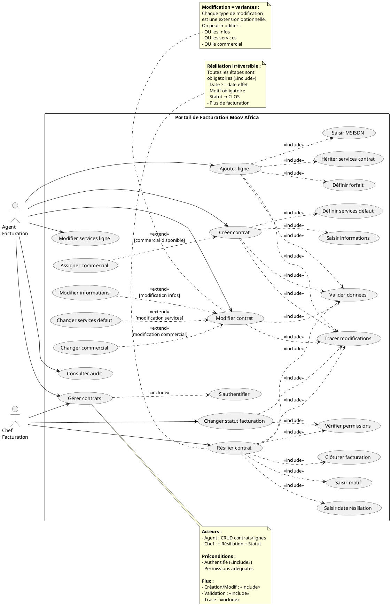

---


### 3.3 Consulter les factures

**Description :** Consultation et téléchargement de factures selon le rôle

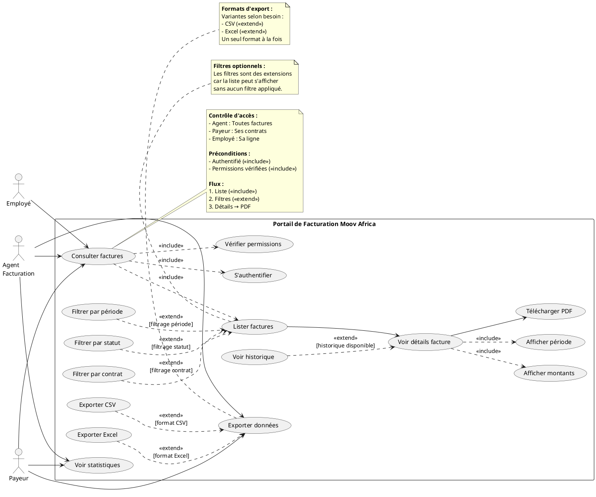

---

### 3.4 Gérer les utilisateurs

**Description :** Création et gestion des utilisateurs du système

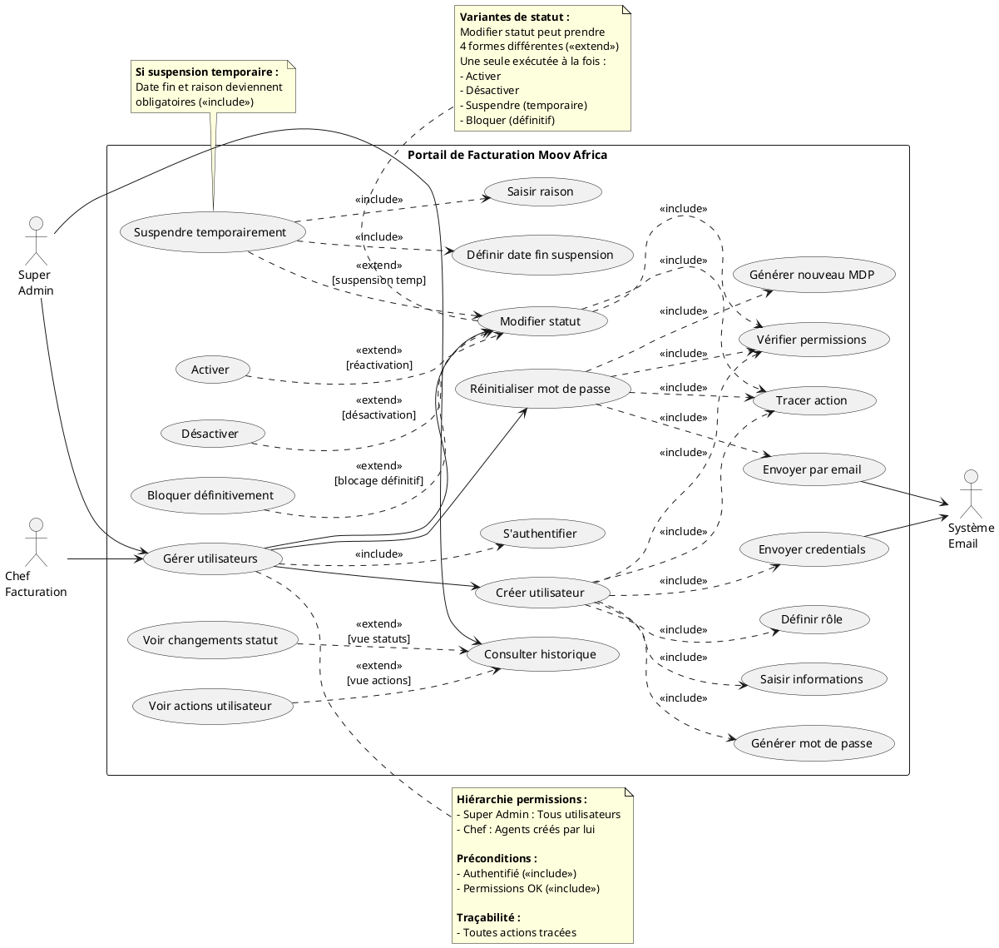

---


### 3.5 Affecter employés aux lignes

**Description :** Affectation et gestion des employés sur les lignes téléphoniques

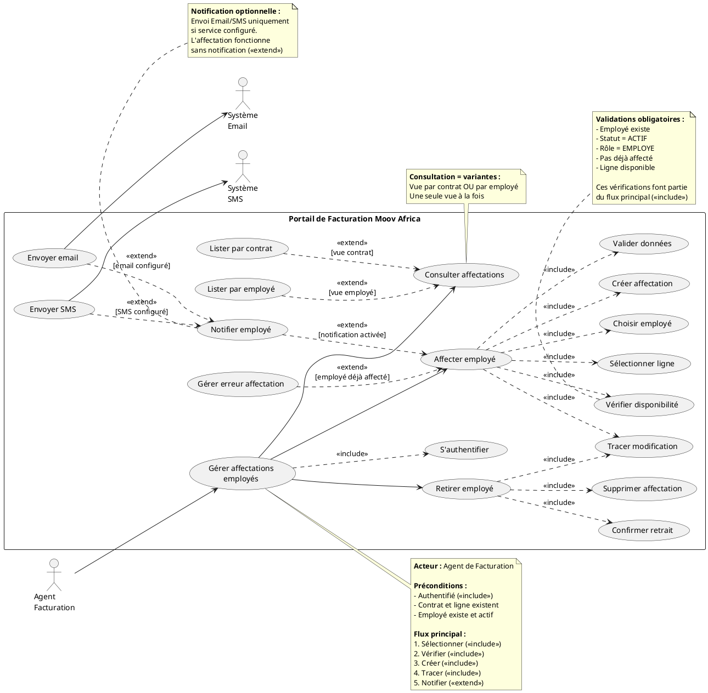

---

## 📝 Notes techniques

### Rôles et permissions

| Rôle | Permissions principales |
|------|------------------------|
| **SUPER_ADMIN** | Toutes les permissions (*) |
| **CHEF_FACTURATION** | Gestion agents, publication, annulation, tarifs, rapports |
| **AGENT_FACTURATION** | Gestion contrats, publication, consultation, création tarifs |
| **PAYEUR** | Consultation ses factures uniquement |
| **EMPLOYE** | Consultation sa facture uniquement |

### Statuts des factures

- **BROUILLON** : En cours de création
- **EN_COURS** : Validée mais non publiée
- **VALIDEE** : Prête pour publication
- **PUBLIEE** : Disponible pour le client
- **PAYEE** : Réglée par le client
- **ANNULEE** : Annulée par un chef/admin

### Statuts des contrats

- **ACTIF** : Contrat actif, facturation normale
- **SUSPENDU** : Facturation suspendue temporairement
- **CLOS** : Contrat résilié, plus de facturation
- **EN_ATTENTE** : En attente d'activation

---

## 🎯 Légende PlantUML

### Relations entre acteurs et cas d'utilisation
- `-->` : Association (acteur utilise cas d'utilisation)

### Relations entre cas d'utilisation

#### ✅ **<<include>>** (INCLUSION - OBLIGATOIRE)
```
[Cas de base] ..> [Cas inclus] : <<include>>
```
- **Définition :** Le cas de base a **TOUJOURS BESOIN** du cas inclus
- **Direction :** Du cas de base → vers le cas inclus
- **Exécution :** OBLIGATOIRE, systématique
- **Exemple :** "Publier facture" ..> "S'authentifier" : <<include>>
  - On ne peut pas publier sans s'authentifier

#### 🔀 **<<extend>>** (EXTENSION - OPTIONNELLE)
```
[Cas d'extension] ..> [Cas de base] : <<extend>>\n[condition]
```
- **Définition :** Le cas de base peut fonctionner **SEUL**, enrichi optionnellement
- **Direction :** Du cas d'extension → vers le cas de base
- **Exécution :** CONDITIONNELLE, optionnelle
- **Exemple :** "Envoyer SMS" ..> "Publier facture" : <<extend>>\n[SMS activé]
  - On peut publier sans envoyer de SMS

### 📋 Tableau récapitulatif

| Critère | <<include>> | <<extend>> |
|---------|-------------|------------|
| **Obligatoire** | ✅ OUI - Toujours exécuté | ❌ NON - Conditionnel |
| **Direction flèche** | Base → Inclus | Extension → Base |
| **Dépendance** | Forte (nécessaire) | Faible (optionnel) |
| **Condition** | Aucune | Oui (entre crochets) |
| **Cas de base sans** | ❌ Ne fonctionne pas | ✅ Fonctionne |
| **Usage** | Factorisation comportement commun | Variantes, options, exceptions |

### 💡 Exemples du projet

#### <<include>> (Obligatoire)
- Publier facture ..> S'authentifier : <<include>>
- Créer contrat ..> Valider données : <<include>>
- Toute action ..> Tracer modifications : <<include>>
- Créer utilisateur ..> Générer mot de passe : <<include>>

#### <<extend>> (Optionnel)
- Envoyer Email ..> Publier facture : <<extend>>\n[email configuré]
- Gérer erreur ..> Matcher contrats : <<extend>>\n[aucun match]
- Filtrer par période ..> Lister factures : <<extend>>\n[filtrage actif]
- Suspendre ..> Modifier statut : <<extend>>\n[suspension demandée]

---

**Document généré le :** 06 août 2026  
**Projet :** Portail de Facturation Moov Africa Togo  
**Version :** 2.0 (Corrections <<include>> et <<extend>>)
