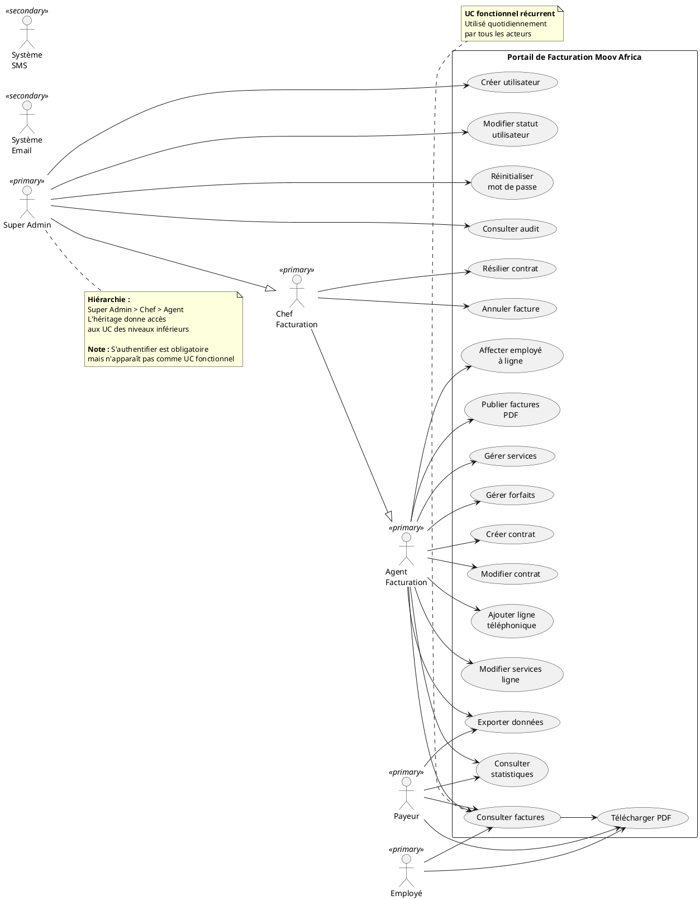
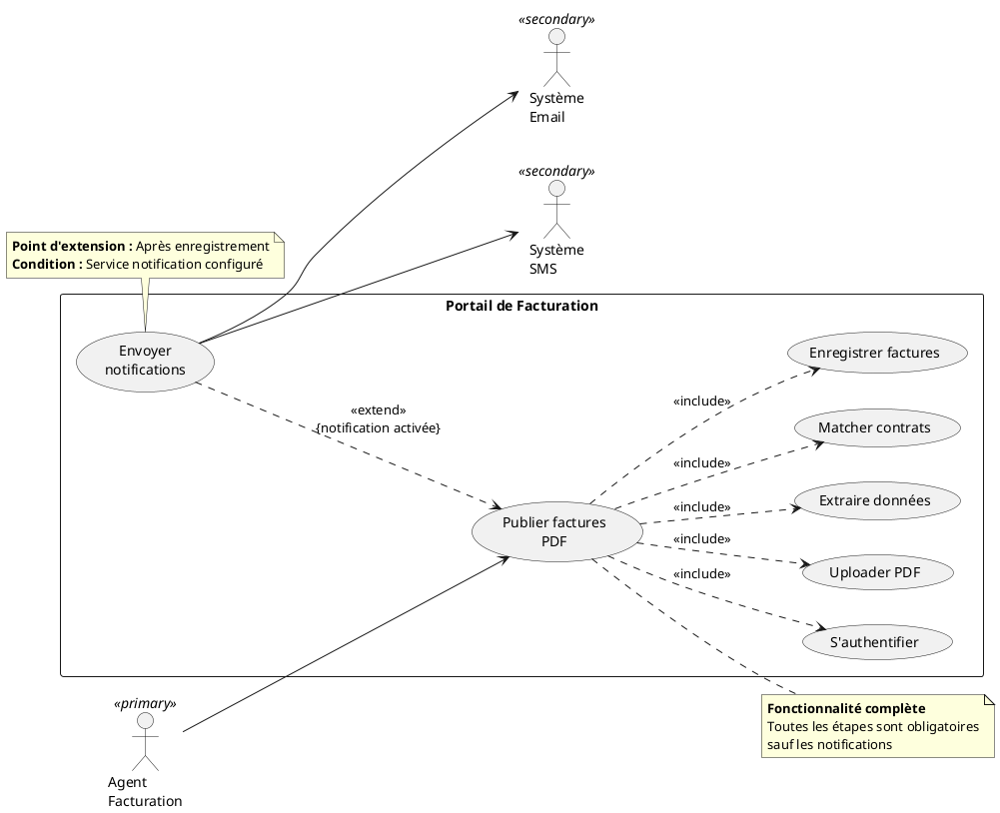
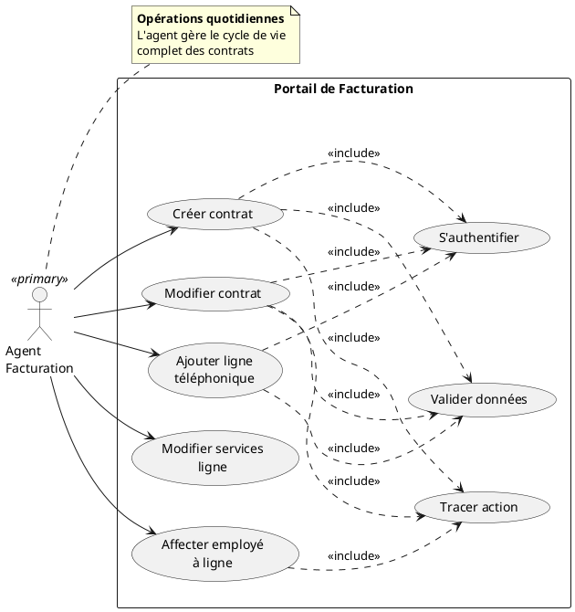
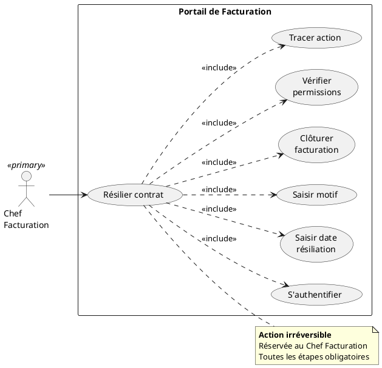
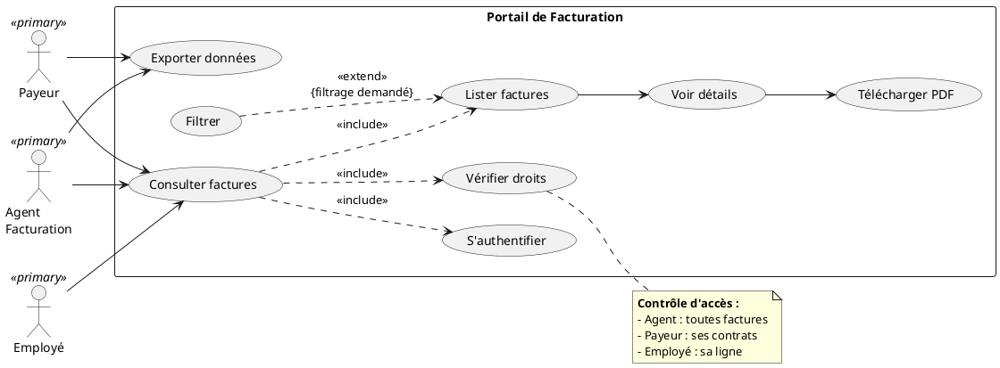
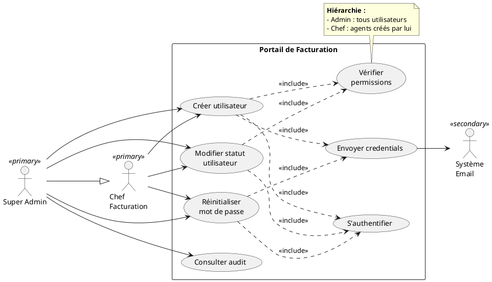

# 📊 Diagrammes de Cas d'Utilisation UML
## Portail de Facturation Moov Africa Togo

**Version :** 3.0 (Conforme règles académiques UML)  
**Date :** 06 août 2026  
**Auteur :** Benoit BANLEPO Mintre

---

## ⚠️ Règles UML appliquées

Ce document respecte les règles académiques des diagrammes de cas d'utilisation :
- ✅ Vision utilisateur (pas technique)
- ✅ Fonctionnalités essentielles uniquement
- ✅ Limites du système clairement définies
- ✅ Acteurs principaux/secondaires distingués
- ✅ Relations `<<include>>` et `<<extend>>` correctes
- ✅ Descriptions textuelles pour cas importants
- ✅ Diagrammes lisibles et non surchargés

---

## Table des matières

1. [Limites du système](#1-limites-du-système)
2. [Identification des acteurs](#2-identification-des-acteurs)
3. [Diagramme global](#3-diagramme-global)
4. [Diagrammes détaillés](#4-diagrammes-détaillés)
5. [Descriptions textuelles](#5-descriptions-textuelles)
6. [Règles UML](#6-règles-uml)

---

## 1. Limites du système

### Système : **Portail de Facturation Moov Africa Togo**

**Objectif :** Permettre la gestion et la consultation des factures des clients entreprises.

**Périmètre :**

- ✅ **Dans le système :** Gestion contrats, publication factures, consultation, notifications
- ❌ **Hors système :** Génération factures (système billing Moov), paiement

**Frontières :**
```
┌──────────────────────────────────────────┐
│  PORTAIL DE FACTURATION MOOV AFRICA      │
│                                          │
│  • Gestion contrats entreprises         │
│  • Publication factures PDF             │
│  • Consultation factures                │
│  • Notifications clients                │
│  • Administration système               │
│                                          │
└──────────────────────────────────────────┘
```

---

## 2. Identification des acteurs

### 2.1 Acteurs humains (principaux)

| Acteur | Description | Responsabilités principales |
|--------|-------------|----------------------------|
| **Super Admin** | Administrateur système | Configuration, gestion tous utilisateurs |
| **Chef Facturation** | Responsable facturation | Supervision, validation, résiliation |
| **Agent Facturation** | Opérateur facturation | Publication factures quotidienne |
| **Payeur** | Client entreprise | Consultation ses contrats et factures |
| **Employé** | Salarié entreprise cliente | Consultation sa facture personnelle |

### 2.2 Acteurs systèmes (secondaires)

| Acteur | Type | Description |
|--------|------|-------------|
| **Système Email** | <<actor>> | Service SMTP (Gmail) |
| **Système SMS** | <<actor>> | Service SMS (Vonage) |

### 2.3 Hiérarchie des acteurs

```
Super Admin
    |
    ├─ Chef Facturation
    |      |
    |      └─ Agent Facturation
    |
Payeur
    |
    └─ Employé
```

---

## 3. Diagramme global

### Vue d'ensemble - Fonctionnalités essentielles




**Note :** Seuls les cas d'utilisation fonctionnels et récurrents sont représentés. Les actions techniques (authentification, validation, traçage) sont implicites.

---

## 4. Diagrammes détaillés

### 4.1 Publier des factures

**Acteur principal :** Agent Facturation  
**Acteurs secondaires :** Système Email, Système SMS  
**Objectif :** Publier les factures mensuelles des clients depuis des fichiers PDF



---

### 4.2 Gérer contrats

**Acteur principal :** Agent Facturation  
**Objectif :** Créer et gérer les contrats clients



---

### 4.3 Résilier contrat

**Acteur principal :** Chef Facturation  
**Objectif :** Résilier définitivement un contrat client



---

### 4.4 Consulter factures

**Acteurs principaux :** Agent, Payeur, Employé  
**Objectif :** Consulter et télécharger les factures selon les droits



---

### 4.5 Gérer utilisateurs

**Acteur principal :** Super Admin, Chef Facturation  
**Objectif :** Créer et administrer les comptes utilisateurs



---

## 5. Descriptions textuelles

### 5.1 UC04 - Publier factures

#### Partie 1 : Identification

| Élément | Valeur |
|---------|--------|
| **Titre** | Publier factures |
| **Résumé** | L'agent de facturation publie les factures mensuelles à partir de fichiers PDF fournis par le système de billing |
| **Acteur principal** | Agent Facturation |
| **Acteurs secondaires** | Système Email, Système SMS |
| **Date** | 06/08/2026 |
| **Version** | 1.0 |

#### Partie 2 : Scénarios

**Préconditions :**
- L'agent est authentifié
- Les fichiers PDF sont disponibles
- Les contrats existent en base

**Scénario nominal :**
1. L'agent sélectionne le fichier PDF à publier
2. Le système extrait les métadonnées des factures
3. Le système associe chaque facture à son contrat
4. Le système enregistre les factures en base
5. Le système stocke les fichiers PDF
6. Le système affiche un récapitulatif de la publication

**Scénarios alternatifs :**
- **A1. Notifications activées**
  - Point d'extension : Après étape 6
  - Le système envoie des notifications par email
  - Le système envoie des notifications par SMS
  - Retour au scénario nominal

**Scénarios d'exception :**
- **E1. Aucun contrat trouvé**
  - Le système affiche un message d'erreur
  - L'agent peut corriger et réessayer
- **E2. PDF déjà publié**
  - Le système refuse la publication (évite doublon)
  - Fin du cas d'utilisation

**Postconditions :**
- Les factures sont enregistrées en base
- Les PDF sont stockés
- Les clients peuvent consulter leurs factures
- Les notifications sont envoyées (si activées)

#### Partie 3 : Exigences non fonctionnelles

- **Performance :** Traiter un PDF de 500 factures en moins de 2 minutes
- **Sécurité :** Vérifier l'authenticité du PDF avant traitement
- **Fiabilité :** Aucune perte de données en cas d'échec partiel
- **Interface :** Progress bar durant le traitement

---

### 5.2 UC05 - Consulter factures

#### Partie 1 : Identification

| Élément | Valeur |
|---------|--------|
| **Titre** | Consulter factures |
| **Résumé** | Les utilisateurs consultent leurs factures selon leurs permissions |
| **Acteurs principaux** | Agent Facturation, Payeur, Employé |
| **Date** | 06/08/2026 |
| **Version** | 1.0 |

#### Partie 2 : Scénarios

**Préconditions :**
- L'utilisateur est authentifié
- Des factures existent pour cet utilisateur

**Scénario nominal :**
1. L'utilisateur accède à la liste des factures
2. Le système affiche les factures selon les permissions
   - Agent : toutes les factures
   - Payeur : factures de ses contrats
   - Employé : sa facture uniquement
3. L'utilisateur sélectionne une facture
4. Le système affiche les détails
5. L'utilisateur peut télécharger le PDF

**Scénarios alternatifs :**
- **A1. Export des données**
  - L'agent ou le payeur demande un export
  - Le système génère un fichier CSV ou Excel
  - Le système lance le téléchargement

**Scénarios d'exception :**
- **E1. Aucune facture disponible**
  - Le système affiche un message informatif
  - Fin du cas d'utilisation

**Postconditions :**
- L'utilisateur a consulté ses factures
- Le téléchargement PDF est effectué (si demandé)

---

## 6. Règles UML

### 6.1 Relations

| Relation | Notation | Signification | Direction |
|----------|----------|---------------|-----------|
| **Association** | `-->` | Communication simple | Acteur → UC |
| **Include** | `..> <<include>>` | Sous-fonction obligatoire | Base → Inclus |
| **Extend** | `..> <<extend>>` | Sous-fonction optionnelle | Extension → Base |
| **Généralisation** | `---|>` | Héritage/Spécialisation | Spécifique → Général |

### 6.2 Règles appliquées

✅ **DO (Bonnes pratiques) :**
- Nommer avec verbe à l'infinitif
- Définir clairement les limites du système
- Distinguer acteurs principal/secondaire
- Utiliser `<<include>>` pour fonctions communes obligatoires
- Utiliser `<<extend>>` pour comportements optionnels
- Ajouter descriptions textuelles pour UC importants

❌ **DON'T (Erreurs à éviter) :**
- Trop de détails techniques
- Décomposition hiérarchique excessive
- Confondre `<<include>>` et `<<extend>>`
- Surcharger le diagramme
- Oublier de définir les limites

---

**FIN DU DOCUMENT**

