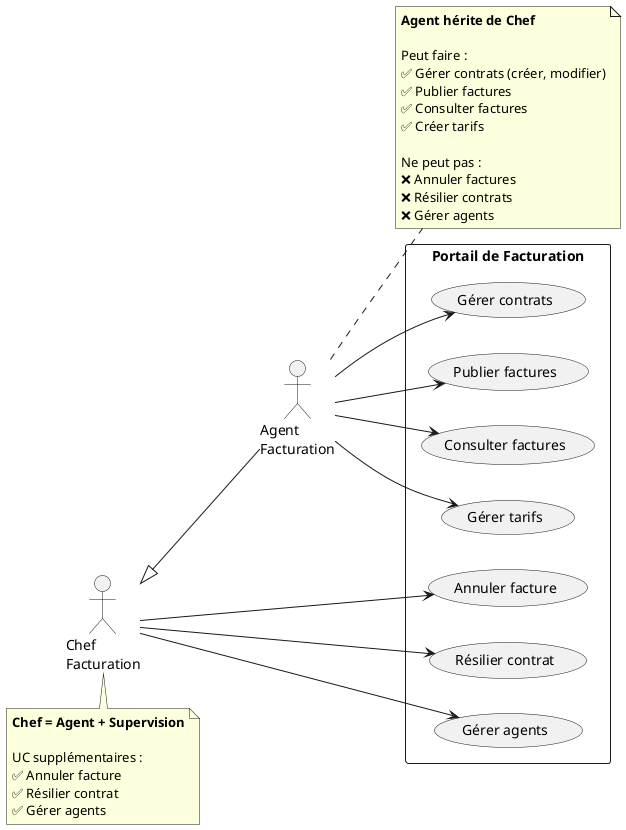
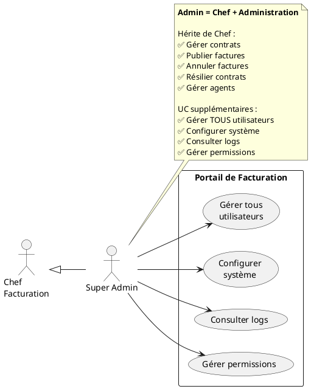
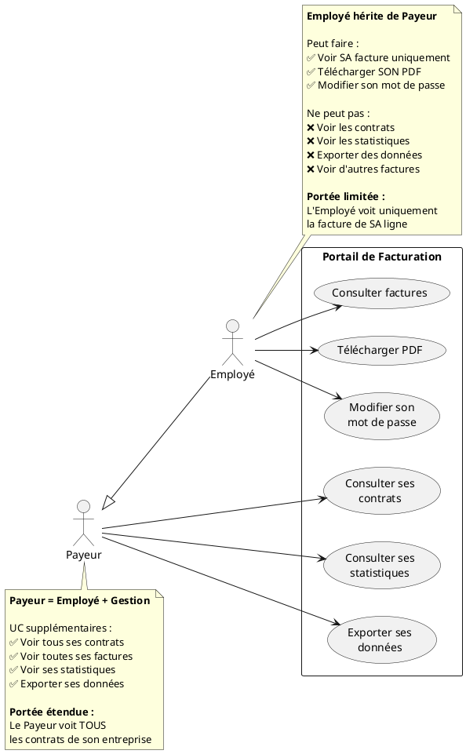
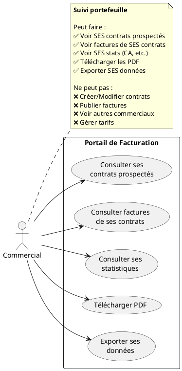

# 📊 Diagrammes de Cas d'Utilisation par Acteur
## Portail de Facturation Moov Africa Togo

**Version :** 1.0  
**Date :** 9 août 2026  
**Auteur :** Benoit BANLEPO Mintre

---

## Table des matières

1. [Chef & Agent Facturation (avec héritage)](#1-chef--agent-facturation)
2. [Super Admin](#2-super-admin)
3. [Payeur](#3-payeur)
4. [Employé](#4-employé)
5. [Commercial](#5-commercial)

---

## 1. Chef & Agent Facturation

### Principe de l'héritage

**Agent Facturation** hérite de tous les cas d'utilisation du **Chef Facturation**.
Le Chef a des UC supplémentaires (administration, supervision).



---

### Récapitulatif Chef vs Agent

| Cas d'utilisation | Agent | Chef |
|-------------------|-------|------|
| **Gestion Contrats** |
| Créer contrat | ✅ | ✅ (hérité) |
| Modifier contrat | ✅ | ✅ (hérité) |
| Résilier contrat | ❌ | ✅ **Chef uniquement** |
| Ajouter ligne | ✅ | ✅ (hérité) |
| Modifier services ligne | ✅ | ✅ (hérité) |
| Affecter employé | ✅ | ✅ (hérité) |
| **Gestion Facturation** |
| Publier factures | ✅ | ✅ (hérité) |
| Consulter factures | ✅ | ✅ (hérité) |
| Annuler facture | ❌ | ✅ **Chef uniquement** |
| Télécharger PDF | ✅ | ✅ (hérité) |
| Exporter données | ✅ | ✅ (hérité) |
| **Gestion Tarifs** |
| Créer forfait | ✅ | ✅ (hérité) |
| Créer service | ✅ | ✅ (hérité) |
| Modifier forfait | ❌ | ✅ **Chef uniquement** |
| Modifier service | ❌ | ✅ **Chef uniquement** |
| Activer/Désactiver tarif | ❌ | ✅ **Chef uniquement** |
| **Gestion Utilisateurs** |
| Créer agent | ❌ | ✅ **Chef uniquement** |
| Modifier statut agent | ❌ | ✅ **Chef uniquement** |
| Réinitialiser mot de passe | ❌ | ✅ **Chef uniquement** |
| **Rapports** |
| Consulter statistiques | ✅ | ✅ (hérité) |
| Consulter audit | ❌ | ✅ **Chef uniquement** |

---

## 2. Super Admin

### Diagramme complet



---

## 3. Payeur & Employé (avec héritage)

### Principe de l'héritage

**Employé** hérite des cas d'utilisation du **Payeur** (consultation factures, téléchargement PDF).
Le Payeur a des UC supplémentaires (contrats, statistiques, export).



### Récapitulatif Payeur vs Employé

| Cas d'utilisation | Employé | Payeur |
|-------------------|---------|--------|
| **Consultation** |
| Consulter factures | ✅ (SA ligne) | ✅ (hérité + TOUTES ses factures) |
| Télécharger PDF | ✅ | ✅ (hérité) |
| Modifier mot de passe | ✅ | ✅ (hérité) |
| **Gestion (Payeur uniquement)** |
| Consulter contrats | ❌ | ✅ **Payeur uniquement** |
| Consulter statistiques | ❌ | ✅ **Payeur uniquement** |
| Exporter données | ❌ | ✅ **Payeur uniquement** |

**Différence clé :**
- **Employé** : Voit uniquement **SA facture individuelle** (1 ligne)
- **Payeur** : Voit **TOUTES les factures de son entreprise** (tous contrats)

---

## 4. Commercial

### Diagramme complet



---

## 📊 Tableau Récapitulatif Global

| Cas d'utilisation | Admin | Chef | Agent | Commercial | Payeur | Employé |
|-------------------|-------|------|-------|------------|--------|---------|
| **Gestion Utilisateurs** |
| Créer utilisateur (tous rôles) | ✅ | ❌ | ❌ | ❌ | ❌ | ❌ |
| Créer agent | ✅ | ✅ | ❌ | ❌ | ❌ | ❌ |
| Modifier utilisateur | ✅ | ✅* | ❌ | ❌ | ❌ | ❌ |
| Modifier son mot de passe | ✅ | ✅ | ✅ | ✅ | ✅ | ✅ |
| Gérer permissions | ✅ | ❌ | ❌ | ❌ | ❌ | ❌ |
| **Gestion Contrats** |
| Créer contrat | ✅ | ✅ | ✅ | ❌ | ❌ | ❌ |
| Modifier contrat | ✅ | ✅ | ✅ | ❌ | ❌ | ❌ |
| Résilier contrat | ✅ | ✅ | ❌ | ❌ | ❌ | ❌ |
| Consulter ses contrats | - | ✅ | ✅ | ✅ | ✅ | ❌ |
| **Gestion Facturation** |
| Publier factures | ✅ | ✅ | ✅ | ❌ | ❌ | ❌ |
| Annuler facture | ✅ | ✅ | ❌ | ❌ | ❌ | ❌ |
| Consulter toutes factures | ✅ | ✅ | ✅ | ❌ | ❌ | ❌ |
| Consulter ses factures | - | ✅ | ✅ | ✅** | ✅ | ✅*** |
| Télécharger PDF | ✅ | ✅ | ✅ | ✅ | ✅ | ✅ |
| **Gestion Tarifs** |
| Créer tarif | ✅ | ✅ | ✅ | ❌ | ❌ | ❌ |
| Modifier tarif | ✅ | ✅ | ❌ | ❌ | ❌ | ❌ |
| Activer/Désactiver | ✅ | ✅ | ❌ | ❌ | ❌ | ❌ |
| **Rapports & Export** |
| Consulter toutes stats | ✅ | ✅ | ✅ | ❌ | ❌ | ❌ |
| Consulter ses stats | - | ✅ | ✅ | ✅ | ✅ | ❌ |
| Exporter toutes données | ✅ | ✅ | ❌ | ❌ | ❌ | ❌ |
| Exporter ses données | - | ✅ | ✅ | ✅ | ✅ | ❌ |
| Consulter audit | ✅ | ✅ | ❌ | ❌ | ❌ | ❌ |
| Consulter logs système | ✅ | ✅ | ❌ | ❌ | ❌ | ❌ |

**Légendes :**
- *Chef : uniquement ses agents
- **Commercial : factures de ses contrats prospectés
- ***Employé : uniquement SA facture individuelle

---

## 🔄 Hiérarchies d'Héritage

```
Super Admin
    ↑
    |
Chef Facturation
    ↑
    |
Agent Facturation

Payeur
    ↑
    |
Employé

Commercial (indépendant)
```

**Règle d'héritage :**
L'acteur spécialisé hérite de TOUS les UC de l'acteur général + ses UC spécifiques.

**Hiérarchies dans le système :**

1. **Hiérarchie Administration** : Admin > Chef > Agent
   - Héritage complet des permissions
   - Chaque niveau ajoute des UC de supervision

2. **Hiérarchie Consultation** : Payeur > Employé  
   - Héritage des UC de base (consulter, télécharger)
   - Payeur a UC supplémentaires (contrats, stats, export)
   - **Différence de portée** : Employé (1 ligne) vs Payeur (toute l'entreprise)

3. **Acteur indépendant** : Commercial
   - Aucun héritage
   - UC spécifiques au suivi commercial

---

**FIN DU DOCUMENT**
