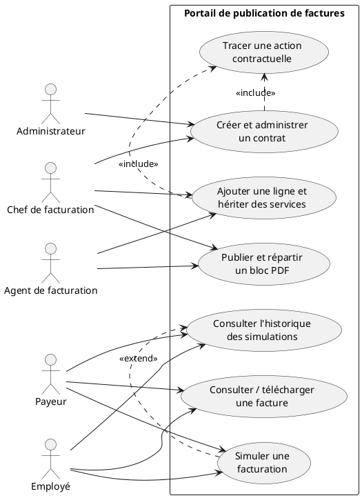
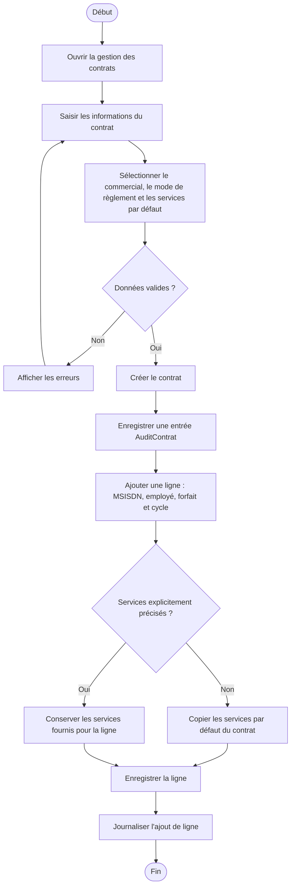
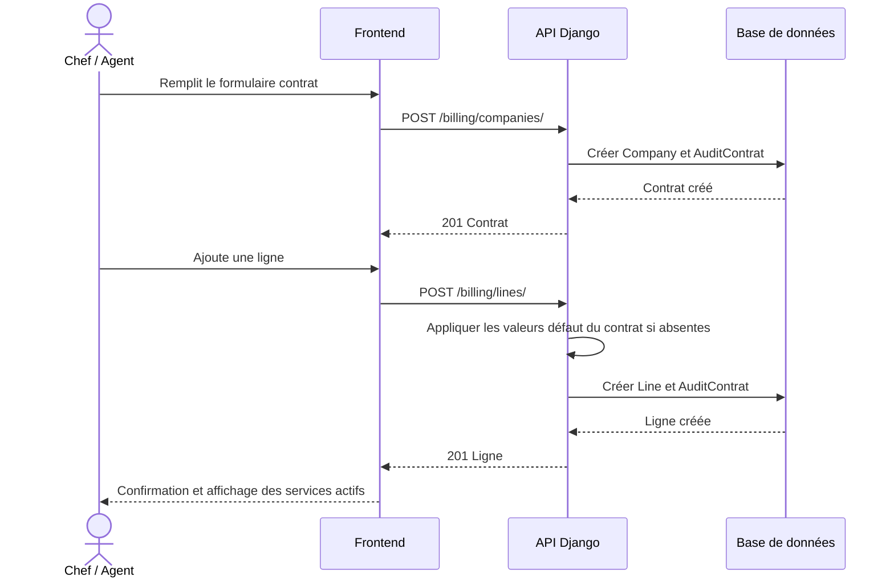
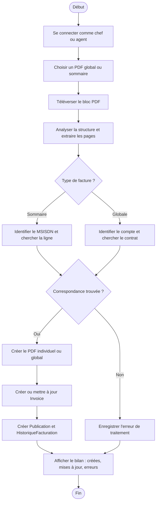
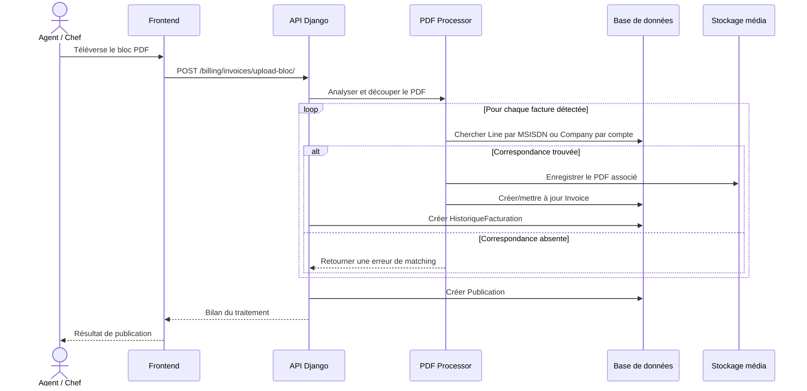
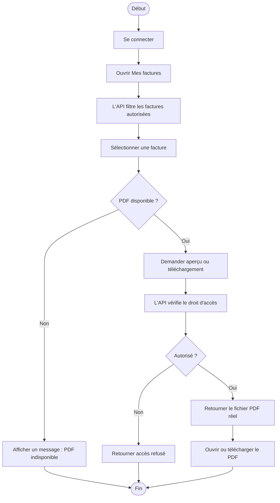
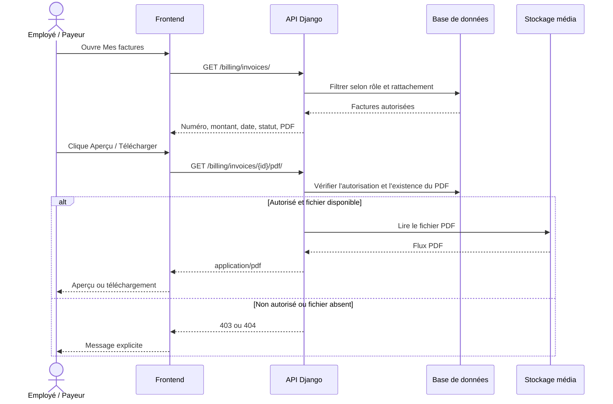
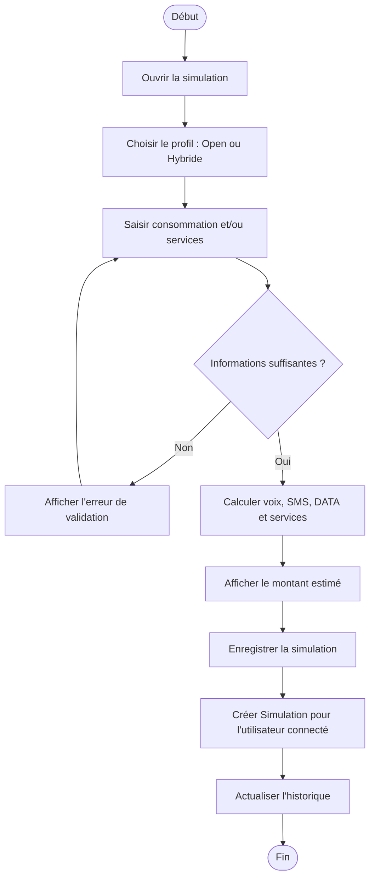
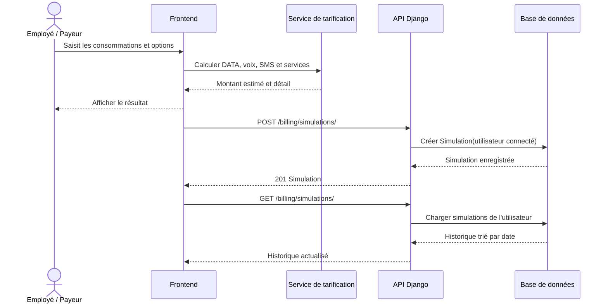

# Diagrammes UML — Portail de publication des factures Moov Africa

Ce document décrit l'état fonctionnel et technique actuel de l'application. Il
remplace l'ancien diagramme de classes : les noms correspondent aux modèles
Django existants (`User`, `Company`, `Line`, `Invoice`, etc.).

Les diagrammes de classes, d'activité et de séquence sont écrits en Mermaid.
Le diagramme de cas d'utilisation est écrit en PlantUML, car Mermaid ne prend
pas en charge la notation UML standard des cas d'utilisation.

## 1. Diagramme de classes détaillé

Le diagramme ci-dessous est le diagramme de référence. Les champs techniques
automatiques (`date_creation`, `date_modification`) sont volontairement visibles
car ils participent à la traçabilité de l'application.

```mermaid
classDiagram
direction LR

class User {
  +UUID id
  +String username
  +String email
  +String password
  +String first_name
  +String last_name
  +String telephone
  +Role role
  +StatutCompte status
  +Boolean est_actif
  +JSON custom_permissions
  +DateTime status_changed_at
  +String status_reason
  +DateTime status_end_date
  +DateTime date_creation
  +DateTime date_modification
  +has_permission(permission) Boolean
  +can_manage_user(user) Boolean
}

%% Classes fonctionnelles représentant les rôles portés par User.role.
%% Elles ne correspondent pas à des tables distinctes dans Django.
class Administrateur {
  <<role fonctionnel>>
  +creerCompte()
  +modifierCompte()
  +activerDesactiverCompte()
  +consulterTousLesContrats()
  +consulterLesJournaux()
}

class ChefFacturation {
  <<role fonctionnel>>
  +creerContrat()
  +affecterPayeurEtEmploye()
  +gererCommerciaux()
  +publierFactures()
  +consulterStatistiques()
}

class AgentFacturation {
  <<role fonctionnel>>
  +gererForfaitsEtServices()
  +ajouterLigne()
  +traiterBlocPDF()
  +consulterFactures()
}

class Payeur {
  <<role fonctionnel>>
  +consulterContrat()
  +consulterLignes()
  +consulterFactures()
  +telechargerFacture()
  +simulerFacturation()
}

class Employe {
  <<role fonctionnel>>
  +consulterSesFactures()
  +telechargerFacture()
  +simulerFacturation()
  +consulterHistoriqueSimulations()
}

class AuthService {
  <<service applicatif>>
  +authentifier(email, motDePasse)
  +genererJWT()
  +reinitialiserMotDePasse()
  +verifierPermissions()
}

class ContractService {
  <<service applicatif>>
  +creerContrat()
  +modifierContrat()
  +resilierContrat()
  +appliquerServicesParDefaut()
  +journaliserAction()
}

class PDFProcessor {
  <<service applicatif>>
  +analyserStructurePDF()
  +detecterFactureSommaireOuGlobale()
  +extraireMSISDN()
  +extraireCompte()
  +decouperEtAssocierPDF()
}

class FacturationService {
  <<service applicatif>>
  +genererFacture()
  +publierFacture()
  +controlerAccesPDF()
  +telechargerPDF()
}

class SimulationService {
  <<service applicatif>>
  +calculerVoix()
  +calculerSMS()
  +calculerData()
  +enregistrerSimulation()
}

class NotificationService {
  <<service prévu>>
  +notifierDisponibiliteFacture()
  +envoyerEmail()
  +envoyerSMS()
}

class StatusHistory {
  +Integer id
  +String old_status
  +String new_status
  +String reason
  +DateTime changed_at
  +DateTime end_date
}

class Commercial {
  +Integer id
  +String nom
  +String prenom
  +String matricule
  +String telephone
  +String email
  +Boolean est_actif
  +DateTime date_creation
  +DateTime date_modification
}

class Company {
  +Integer id
  +String compte
  +String raison_sociale
  +String code_commercial
  +String nom_commercial
  +CategorieClient categorie
  +String adresse
  +String adresse_ligne2
  +String email_facturation
  +String statut
  +StatutFacturation statut_factures
  +ModeReglement mode_reglement
  +Date date_effet
  +Date date_fin
  +Boolean est_exonere
  +String motif_exoneration
  +Boolean est_resilie
  +Date date_resiliation
  +String motif_resiliation
  +String observation_resiliation
  +String observation
  +String type_revenu
  +Boolean facture_detaillee_defaut
  +String option_nolimit_defaut
  +String option_blackberry_defaut
  +Boolean est_incognito_defaut
  +Boolean roaming_defaut
  +Boolean internet_defaut
  +Boolean international_defaut
  +Boolean est_non_revenu_defaut
  +DateTime date_creation
  +DateTime date_modification
}

class Line {
  +Integer id
  +String msisdn
  +String utilisateur
  +Decimal forfait
  +CycleFacturation cycle
  +String statut
  +Boolean facture_detaillee
  +String option_nolimit
  +String option_blackberry
  +Boolean est_incognito
  +Boolean est_roaming
  +Boolean est_internet
  +Boolean est_international
  +Boolean est_non_revenu
  +DateTime date_creation
  +DateTime date_modification
}

class Package {
  +UUID id
  +String nom
  +String code
  +TypeForfait type_forfait
  +Decimal prix_mensuel
  +Integer quota_data_mo
  +Integer quota_minutes
  +Integer quota_sms
  +Boolean est_actif
  +DateTime date_creation
  +DateTime date_modification
}

class Service {
  +UUID id
  +String nom
  +String code
  +TypeService type_service
  +Boolean est_actif
  +DateTime date_creation
  +DateTime date_modification
}

class TarifService {
  +UUID id
  +String nom_option
  +Decimal prix
  +Integer duree_validite_heures
  +String description
  +Boolean est_actif
  +DateTime date_creation
  +DateTime date_modification
}

class Cycle {
  +UUID id
  +DateTime date_debut
  +DateTime date_fin
  +Boolean est_actif
  +DateTime date_creation
  +DateTime date_modification
}

class Invoice {
  +UUID id
  +String numero_facture <<unique>>
  +Date periode_debut
  +Date periode_fin
  +Decimal montant_ht
  +Decimal montant_tva
  +Decimal montant_ttc
  +StatutFacture statut
  +DateTime date_emission
  +Date date_echeance
  +File fichier_pdf
  +String commentaire
  +DateTime date_creation
  +DateTime date_modification
}

class HistoriqueFacturation {
  +UUID id
  +TypeActionFacturation type_action
  +String ancien_statut
  +String nouveau_statut
  +String commentaire
  +DateTime date_action
}

class Publication {
  +UUID id
  +String cycle_facturation
  +Date periode_debut
  +Date periode_fin
  +DateTime date_publication
  +StatutFacture statut
  +Integer nombre_lignes_traitees
  +Decimal montant_total
  +File fichier_pdf
  +String commentaire
  +DateTime date_creation
  +DateTime date_modification
}

class Simulation {
  +UUID id
  +DateTime date_simulation
  +Decimal montant_estime
  +JSON services_selectionnes
  +JSON resultat_detaille
}

class AuditContrat {
  +Integer id
  +TypeActionContrat type_action
  +String description
  +JSON anciennes_valeurs
  +JSON nouvelles_valeurs
  +DateTime date_action
}

class CategorieClient {
  <<enumeration>>
  GE
  PE
  P
  OI
  EP
  A
  NR
}

class CycleFacturation {
  <<enumeration>>
  HYB
  OP
}

class StatutFacture {
  <<enumeration>>
  BROUILLON
  EN_COURS
  VALIDEE
  PUBLIEE
  PAYEE
  ANNULEE
}

class StatutFacturation {
  <<enumeration>>
  ACTIF
  SUSPENDU
  CLOS
  EN_ATTENTE
}

class ModeReglement {
  <<enumeration>>
  CHEQUE
  VIREMENT
  ESPECES
}

class TypeForfait {
  <<enumeration>>
  DATA
  VOIX
  SMS
  MIXTE
}

class TypeService {
  <<enumeration>>
  PASS
  OPTION
  PROMO
}

class TypeActionContrat {
  <<enumeration>>
  CREATION
  MODIFICATION
  CHANGEMENT_STATUT
  CHANGEMENT_COMMERCIAL
  CHANGEMENT_SERVICES
  RESILIATION
  AJOUT_LIGNE
  MODIFICATION_LIGNE
}

class TypeActionFacturation {
  <<enumeration>>
  CREATION
  MODIFICATION
  VALIDATION
  PUBLICATION
  PAIEMENT
  ANNULATION
}

User "0..*" --> "0..1" Company : payeur
User <|.. Administrateur : rôle SUPER_ADMIN
User <|.. ChefFacturation : rôle CHEF_FACTURATION
User <|.. AgentFacturation : rôle AGENT_FACTURATION
User <|.. Payeur : rôle PAYEUR
User <|.. Employe : rôle EMPLOYE
User "1" --> "0..*" StatusHistory : utilisateur concerné
User "0..1" --> "0..*" StatusHistory : changement effectué par
Commercial "0..1" --> "0..*" Company : signe
Company "1" *-- "0..*" Line : possède
User "0..1" --> "0..*" Line : employé
Company "1" --> "0..*" Invoice : reçoit
Line "0..1" --> "0..*" Invoice : facture sommaire
Invoice "1" *-- "0..*" HistoriqueFacturation : historique
User "0..1" --> "0..*" HistoriqueFacturation : exécute
User "1" --> "0..*" Publication : publie
User "1" --> "0..*" Simulation : effectue
Company "1" *-- "0..*" AuditContrat : trace
User "0..1" --> "0..*" AuditContrat : exécute
Service "1" *-- "0..*" TarifService : propose
Line "1" *-- "0..*" Cycle : active
Service "1" --> "0..*" Cycle : concerne
Company --> CategorieClient : catégorie
Company --> StatutFacturation : statut factures
Company --> ModeReglement : règlement
Line --> CycleFacturation : cycle
Package --> TypeForfait : type
Service --> TypeService : type
Invoice --> StatutFacture : statut
Publication --> StatutFacture : statut
AuditContrat --> TypeActionContrat : action
HistoriqueFacturation --> TypeActionFacturation : action
Administrateur ..> AuthService : administre
ChefFacturation ..> ContractService : utilise
AgentFacturation ..> ContractService : utilise
ChefFacturation ..> PDFProcessor : utilise
AgentFacturation ..> PDFProcessor : utilise
PDFProcessor ..> FacturationService : crée / met à jour
FacturationService ..> Invoice : gère
FacturationService ..> Publication : trace
Payeur ..> FacturationService : consulte
Employe ..> FacturationService : consulte
Payeur ..> SimulationService : utilise
Employe ..> SimulationService : utilise
SimulationService ..> Simulation : persiste
FacturationService ..> NotificationService : notifie
```

## 2. Diagramme de cas d'utilisation

## 3. Cas d'utilisation 1 — Créer un contrat et ajouter une ligne

Acteurs : Chef de facturation, Agent de facturation.

### Diagramme d'activité

### Diagramme de séquence

## 4. Cas d'utilisation 2 — Publier un bloc PDF de factures

Acteurs : Agent de facturation, Chef de facturation.

### Diagramme d'activité

### Diagramme de séquence

## 5. Cas d'utilisation 3 — Consulter et télécharger une facture

Acteurs : Employé, Payeur.

### Diagramme d'activité

### Diagramme de séquence

## 6. Cas d'utilisation 4 — Simuler une facturation

Acteurs : Employé, Payeur.

### Diagramme d'activité

### Diagramme de séquence

## Règles de lecture

- Une facture **sommaire** est associée à une `Line` et à son `Company`.
- Une facture **globale** est associée au `Company` uniquement (`Invoice.line` est vide).
- Les services sélectionnés dans `Company` servent de valeurs par défaut lors
  de la création d'une `Line`; une ligne peut ensuite être personnalisée.
- `AuditContrat` trace les changements de contrat; `HistoriqueFacturation`
  trace les changements concernant une facture.
