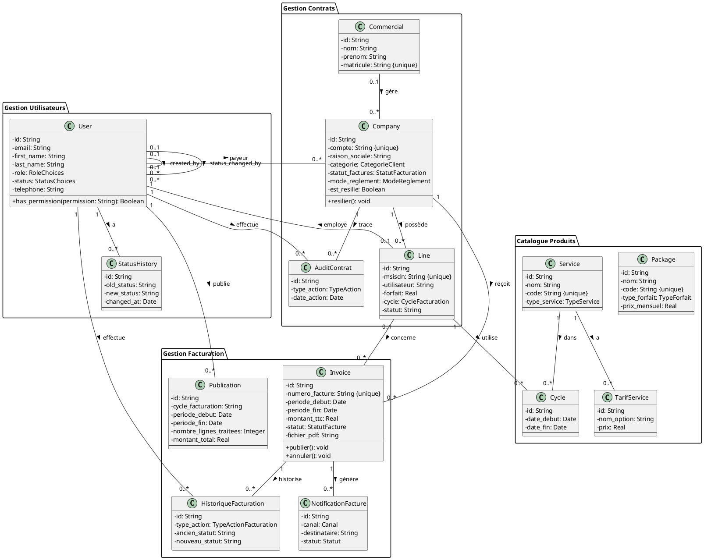
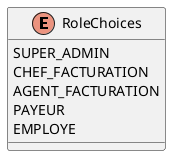
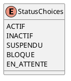
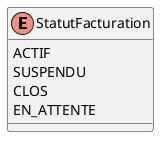
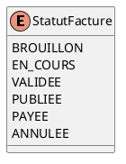
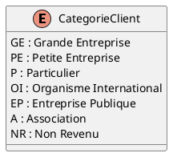
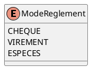
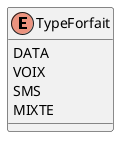
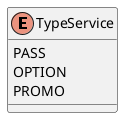
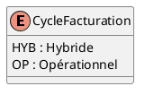

# 📐 Diagramme de Classes UML
## Portail de Facturation Moov Africa Togo

**Version :** 1.0  
**Date :** 06 août 2026  
**Auteur :** Benoit BANLEPO Mintre

---

## Table des matières

1. [Vue d'ensemble](#1-vue-densemble)
2. [Diagramme complet](#2-diagramme-complet)
3. [Classes détaillées](#3-classes-détaillées)
4. [Associations et cardinalités](#4-associations-et-cardinalités)
5. [Enumerations](#5-enumerations)

---

## 1. Vue d'ensemble

### Architecture du modèle

Le système est organisé autour de **4 domaines principaux** :

1. **Gestion des Utilisateurs** (Accounts)
   - User (utilisateurs système)
   - StatusHistory (historique statuts)

2. **Gestion des Contrats** (Billing - Contrats)
   - Commercial (commerciaux Moov)
   - Company (contrats entreprises)
   - Line (lignes téléphoniques)
   - AuditContrat (traçabilité contrats)

3. **Gestion de la Facturation** (Billing - Factures)
   - Invoice (factures)
   - HistoriqueFacturation (historique factures)
   - NotificationFacture (notifications clients)
   - Publication (publications agents)

4. **Catalogue Produits** (Billing - Tarifs)
   - Package (forfaits)
   - Service (services optionnels)
   - TarifService (tarification services)
   - Cycle (affectation services à lignes)

---

## 2. Diagramme complet

### Vue globale du modèle de données

---

## 3. Classes détaillées

### 3.1 Domaine : Gestion Utilisateurs

#### User (Utilisateur)

**Responsabilité :** Représente tous les utilisateurs du système (Admin, Chef, Agent, Payeur, Employé)

**Attributs :**
- `id` : Identifiant unique (UUID)
- `username`, `email`, `password` : Credentials
- `first_name`, `last_name` : Identité
- `role` : Rôle (SUPER_ADMIN, CHEF_FACTURATION, AGENT_FACTURATION, PAYEUR, EMPLOYE)
- `status` : Statut (ACTIF, INACTIF, SUSPENDU, BLOQUE, EN_ATTENTE)
- `telephone` : Numéro de téléphone
- `est_actif` : Boolean actif/inactif
- `custom_permissions` : Permissions personnalisées (JSON)
- `status_changed_at`, `status_reason`, `status_end_date` : Gestion statuts
- `last_login_ip` : Dernière IP de connexion
- `date_creation`, `date_modification` : Audit

**Méthodes :**
- `has_permission(permission)` : Vérifie si l'utilisateur a une permission
- `can_manage_user(target_user)` : Vérifie si peut gérer un autre utilisateur

**Relations :**
- Hérite de : AbstractUser (Django)
- Association réflexive : `created_by` (créateur)
- Association réflexive : `status_changed_by` (modificateur statut)
- Composition : StatusHistory (historique statuts)

---

#### StatusHistory (Historique Statuts)

**Responsabilité :** Trace tous les changements de statut des utilisateurs

**Attributs :**
- `old_status`, `new_status` : Ancien et nouveau statut
- `reason` : Raison du changement
- `end_date` : Date de fin (pour suspension temporaire)
- `changed_at` : Date du changement

**Relations :**
- Agrégation : User (1..*)

---

### 3.2 Domaine : Gestion Contrats

#### Commercial

**Responsabilité :** Représente un commercial Moov Africa

**Attributs :**
- `nom`, `prenom` : Identité
- `matricule` : Code unique du commercial
- `telephone`, `email` : Contact
- `est_actif` : Actif/Inactif

**Relations :**
- Association : Company (0..*)

---

#### Company (Contrat Entreprise)

**Responsabilité :** Représente un contrat client entreprise

**Attributs clés :**
- `compte` : Numéro de compte unique
- `raison_sociale`, `nom_commercial` : Identité entreprise
- `categorie` : Type client (GE, PE, P, OI, EP, A, NR)
- `statut_factures` : Statut facturation (ACTIF, SUSPENDU, CLOS, EN_ATTENTE)
- `mode_reglement` : Mode paiement (CHEQUE, VIREMENT, ESPECES)
- `est_resilie` : Contrat résilié ?
- `date_resiliation`, `motif_resiliation` : Info résiliation

**Méthodes :**
- `resilier(date, motif)` : Résilie le contrat

**Relations :**
- Agrégation : Commercial (0..1)
- Agrégation : User/Payeur (0..1)
- Composition : Line (1..*)
- Composition : Invoice (1..*)
- Composition : AuditContrat (1..*)

---

#### Line (Ligne Téléphonique)

**Responsabilité :** Représente une ligne téléphonique du contrat

**Attributs clés :**
- `msisdn` : Numéro de téléphone unique (8 chiffres)
- `utilisateur` : Nom de l'utilisateur de la ligne
- `forfait` : Montant mensuel
- `cycle` : Cycle facturation (HYB, OP)
- Options : `option_blackberry`, `option_nolimit`
- Services : `est_incognito`, `facture_detaillee`, `est_roaming`, etc.

**Relations :**
- Agrégation : Company (1)
- Agrégation : User/Employé (0..1)
- Association : Invoice (0..*)
- Composition : Cycle (1..*)

---

#### AuditContrat

**Responsabilité :** Traçabilité de toutes les actions sur les contrats

**Attributs :**
- `type_action` : Type d'action (CREATION, MODIFICATION, RESILIATION, etc.)
- `description` : Description de l'action
- `anciennes_valeurs`, `nouvelles_valeurs` : Valeurs avant/après (JSON)
- `date_action` : Horodatage

**Relations :**
- Agrégation : Company (1)
- Agrégation : User (1) - auteur action

---

### 3.3 Domaine : Gestion Facturation

#### Invoice (Facture)

**Responsabilité :** Représente une facture client (globale ou individuelle)

**Attributs clés :**
- `numero_facture` : Numéro interne unique
- `numero_facture_pdf` : Numéro extrait du PDF
- `periode_debut`, `periode_fin` : Période de facturation
- `montant_ht`, `montant_tva`, `montant_ttc` : Montants
- `statut` : Statut (BROUILLON, PUBLIEE, PAYEE, ANNULEE, etc.)
- `fichier_pdf` : Fichier PDF de la facture
- `date_echeance` : Date limite de paiement

**Méthodes :**
- `publier()` : Publie la facture
- `annuler()` : Annule la facture

**Relations :**
- Agrégation : Company (1) - toujours
- Agrégation : Line (0..1) - si facture individuelle (SOM)
- Composition : NotificationFacture (1..*)
- Composition : HistoriqueFacturation (1..*)

---

#### NotificationFacture

**Responsabilité :** Trace les notifications envoyées aux clients

**Attributs :**
- `canal` : Canal utilisé (EMAIL, SMS)
- `destinataire` : Adresse email ou numéro
- `statut` : Statut (ENVOYEE, ECHEC, NON_CONFIGUREE)
- `detail` : Détails ou erreur
- `date_envoi` : Horodatage

**Relations :**
- Agrégation : Invoice (1)

---

#### HistoriqueFacturation

**Responsabilité :** Historise toutes les modifications de factures

**Attributs :**
- `type_action` : Type (CREATION, MODIFICATION, VALIDATION, PUBLICATION, ANNULATION)
- `ancien_statut`, `nouveau_statut` : Changement de statut
- `commentaire` : Commentaire
- `date_action` : Horodatage

**Relations :**
- Agrégation : Invoice (1)
- Agrégation : User (1) - auteur

---

#### Publication

**Responsabilité :** Trace les publications de factures par les agents

**Attributs :**
- `cycle_facturation` : Cycle concerné
- `periode_debut`, `periode_fin` : Période
- `nombre_lignes_traitees` : Nombre de factures publiées
- `montant_total` : Montant total
- `fichier_pdf` : Fichier PDF source
- `date_publication` : Date de publication

**Relations :**
- Agrégation : User/Agent (1)

---

### 3.4 Domaine : Catalogue Produits

#### Package (Forfait)

**Responsabilité :** Représente un forfait tarifaire

**Attributs :**
- `nom`, `code` : Identification
- `type_forfait` : Type (DATA, VOIX, SMS, MIXTE)
- `prix_mensuel` : Prix
- `quota_data_mo`, `quota_minutes`, `quota_sms` : Quotas
- `est_actif` : Actif/Inactif

---

#### Service

**Responsabilité :** Représente un service optionnel

**Attributs :**
- `nom`, `code` : Identification
- `type_service` : Type (PASS, OPTION, PROMO)
- `est_actif` : Actif/Inactif

**Relations :**
- Composition : TarifService (1..*)
- Association : Cycle (0..*)

---

#### TarifService

**Responsabilité :** Tarification d'un service

**Attributs :**
- `nom_option` : Nom de l'option tarifaire
- `prix` : Prix
- `duree_validite_heures` : Durée de validité

**Relations :**
- Agrégation : Service (1)

---

#### Cycle

**Responsabilité :** Affectation d'un service à une ligne pendant une période

**Attributs :**
- `date_debut`, `date_fin` : Période d'activation
- `est_actif` : Actif/Inactif

**Relations :**
- Agrégation : Line (1)
- Agrégation : Service (1)

---

## 4. Associations et cardinalités

### Tableau récapitulatif

| Classe Source | Association | Cardinalité | Classe Cible | Description |
|---------------|-------------|-------------|--------------|-------------|
| **User** | created_by | 0..1 → 0..* | User | Un utilisateur peut créer d'autres utilisateurs |
| **User** | status_changed_by | 0..1 → 0..* | User | Un utilisateur peut modifier le statut d'autres |
| **User** | historique | 1 → 0..* | StatusHistory | Un utilisateur a un historique de statuts |
| **Commercial** | gère | 1 → 0..* | Company | Un commercial gère plusieurs contrats |
| **Company** | payeur | 1 → 0..1 | User | Un contrat a un payeur (User) |
| **Company** | possède | 1 → 0..* | Line | Un contrat possède plusieurs lignes |
| **Company** | reçoit | 1 → 0..* | Invoice | Un contrat reçoit plusieurs factures |
| **Company** | trace | 1 → 0..* | AuditContrat | Un contrat a un audit complet |
| **Line** | employe | 1 → 0..1 | User | Une ligne peut être affectée à un employé |
| **Line** | concerne | 1 → 0..* | Invoice | Une ligne peut avoir des factures individuelles |
| **Line** | utilise | 1 → 0..* | Cycle | Une ligne utilise des services via cycles |
| **Invoice** | génère | 1 → 0..* | NotificationFacture | Une facture génère des notifications |
| **Invoice** | historise | 1 → 0..* | HistoriqueFacturation | Une facture a un historique |
| **Service** | a | 1 → 0..* | TarifService | Un service a plusieurs tarifs |
| **Service** | dans | 1 → 0..* | Cycle | Un service est utilisé dans plusieurs cycles |
| **User** | effectue | 1 → 0..* | AuditContrat | Un utilisateur effectue des actions tracées |
| **User** | effectue | 1 → 0..* | HistoriqueFacturation | Un utilisateur modifie des factures |
| **User** | publie | 1 → 0..* | Publication | Un agent effectue des publications |

---

## 5. Enumerations

### RoleChoices (Rôles Utilisateurs)

**Hiérarchie :** SUPER_ADMIN > CHEF_FACTURATION > AGENT_FACTURATION

---

### StatusChoices (Statuts Utilisateurs)

---

### StatutFacturation (Statuts Contrats)

---

### StatutFacture (Statuts Factures)

---

### CategorieClient (Catégories Clients)

---

### ModeReglement (Modes de Règlement)

---

### TypeForfait (Types de Forfaits)

---

### TypeService (Types de Services)

---

### CycleFacturation (Cycles de Facturation)

---

## 📊 Statistiques du modèle

- **Nombre de classes :** 15
- **Nombre d'enumerations :** 9
- **Nombre total d'associations :** 17
- **Profondeur maximale d'héritage :** 1 (User hérite de AbstractUser)

---

## 🎯 Principes de conception appliqués

✅ **Cohésion forte :** Chaque classe a une responsabilité claire  
✅ **Couplage faible :** Séparation domaines (Utilisateurs, Contrats, Facturation, Catalogue)  
✅ **Traçabilité :** Historiques et audit sur entités critiques  
✅ **Intégrité référentielle :** Relations bien définies avec cardinalités  
✅ **Extensibilité :** Permissions personnalisables, enumerations  

---

**FIN DU DOCUMENT**
