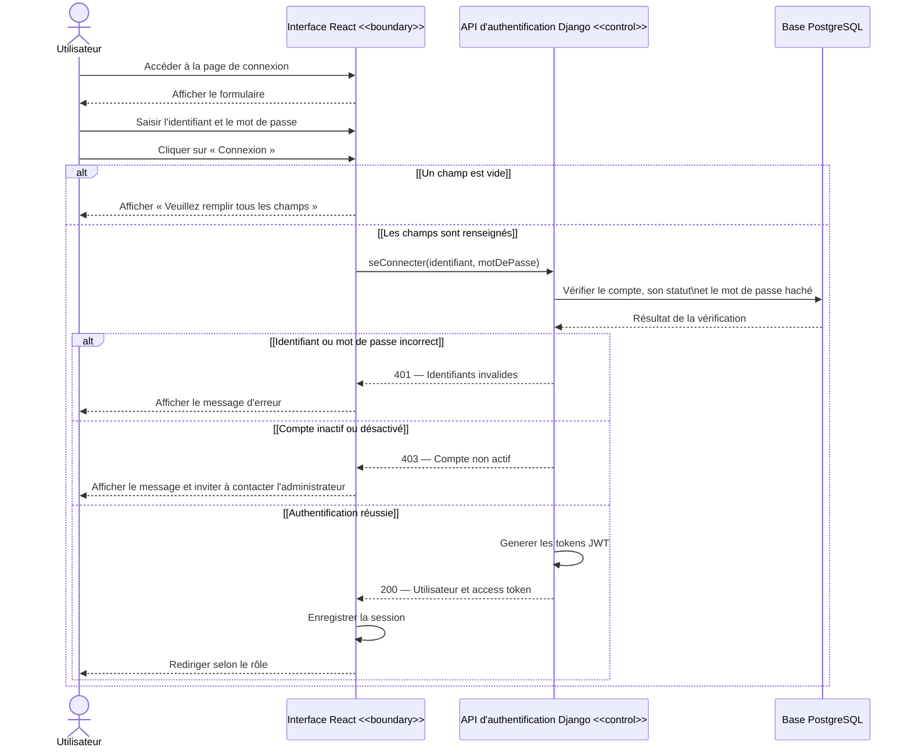

# Diagramme de séquence - S'authentifier

> L'identifiant peut être un e-mail, un nom d'utilisateur ou un MSISDN enregistré comme nom d'utilisateur. L'interface enregistre l'access token et les informations de l'utilisateur ; le refresh token est bien retourné par l'API mais n'est pas encore exploité par le frontend.
