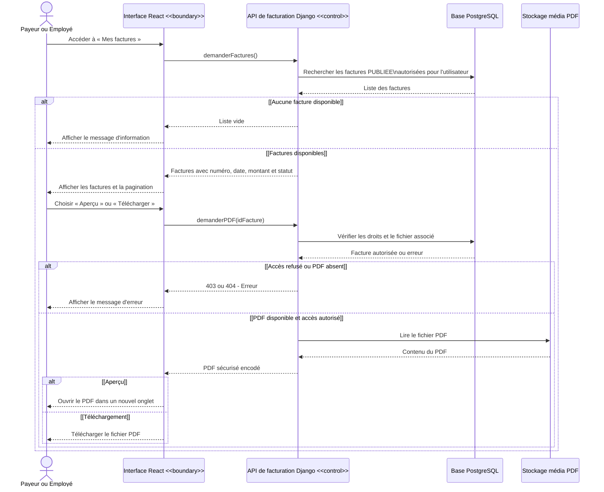

# Diagramme de séquence - Consulter les factures

> Le payeur ne consulte que les factures publiées de son entreprise. L'employé ne consulte que les factures sommaires publiées de la ligne qui lui est attribuée. Le contrôle des droits est appliqué à la liste et à l'accès au PDF.
