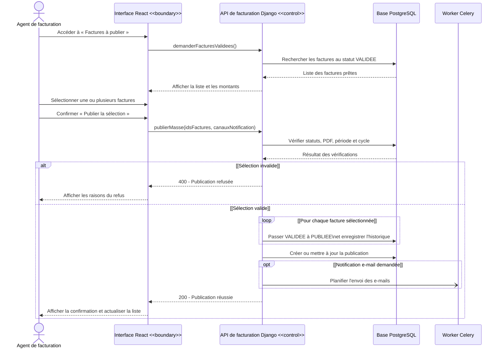

# Diagramme de séquence - Publier les factures

> Seules les factures au statut `VALIDEE`, disposant d'un PDF et appartenant à la même période et au même cycle peuvent être publiées ensemble. L'envoi éventuel d'e-mails est asynchrone et son échec n'annule pas la publication.
