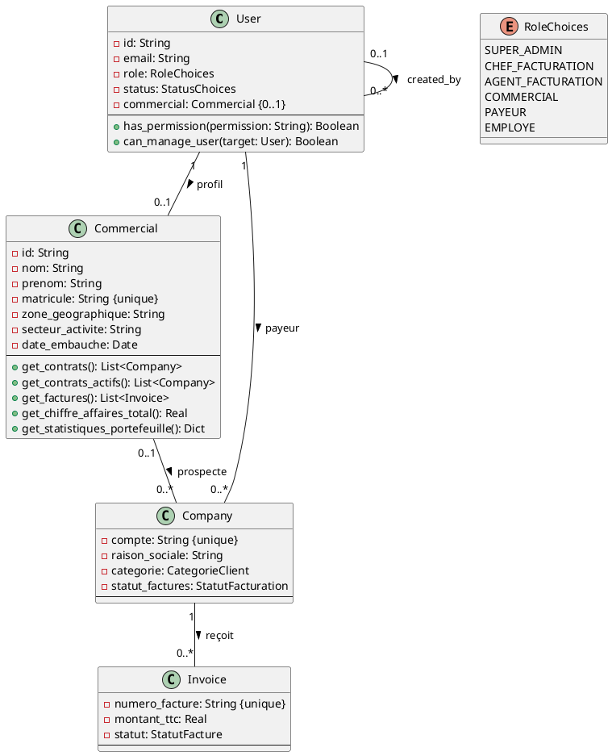

# 📋 Proposition : Table Commercial Enrichie
## Système de Facturation Moov Africa Togo

**Date :** 9 août 2026  
**Auteur :** Benoit BANLEPO Mintre

---

## 🎯 Objectif

Permettre aux **Commerciaux** de :
- Se connecter au système
- Voir uniquement **les contrats qu'ils ont prospectés** (leurs propres contrats)
- Consulter les factures associées à leurs contrats
- Suivre les statistiques de leur portefeuille

---

## 📊 Comparatif des Rôles

### Tableau des Attributs par Rôle

| Attribut / Fonctionnalité | **Commercial** | **Chef Facturation** | **Agent Facturation** |
|---------------------------|----------------|----------------------|----------------------|
| **Authentification** | ✅ Oui | ✅ Oui | ✅ Oui |
| **Voir ses propres contrats** | ✅ Oui (prospectés) | ✅ Oui (tous) | ✅ Oui (tous) |
| **Créer des contrats** | ❌ Non | ✅ Oui | ✅ Oui |
| **Modifier des contrats** | ❌ Non | ✅ Oui | ❌ Non |
| **Voir les factures** | ✅ Oui (ses contrats) | ✅ Oui (toutes) | ✅ Oui (toutes) |
| **Publier des factures** | ❌ Non | ✅ Oui | ✅ Oui |
| **Annuler des factures** | ❌ Non | ✅ Oui | ❌ Non |
| **Gérer les tarifs** | ❌ Non | ✅ Oui (créer/modifier) | ✅ Oui (créer) |
| **Gérer les utilisateurs** | ❌ Non | ✅ Oui (agents) | ❌ Non |
| **Voir les rapports** | ✅ Oui (son portefeuille) | ✅ Oui (tout) | ✅ Oui (tout) |
| **Exporter des données** | ✅ Oui (ses contrats) | ✅ Oui (tout) | ❌ Non |

---

## 🔧 Solution Proposée

### Option 1 : Commercial comme Utilisateur (RECOMMANDÉ)

**Ajouter un nouveau rôle** `COMMERCIAL` dans la table `User` existante.

#### Avantages :
✅ Utilise l'infrastructure d'authentification existante  
✅ Gestion des permissions unifiée  
✅ Simplifie la maintenance  
✅ Audit trail automatique  

#### Modifications à apporter :

**1. Dans `accounts/models.py` :**

```python
class User(AbstractUser):
    ROLE_CHOICES = [
        ('SUPER_ADMIN', 'Super Admin'),
        ('CHEF_FACTURATION', 'Chef Facturation'),
        ('AGENT_FACTURATION', 'Agent Facturation'),
        ('COMMERCIAL', 'Commercial'),  # ← NOUVEAU
        ('PAYEUR', 'Payeur'),
        ('EMPLOYE', 'Employé'),
    ]
    
    # ... autres attributs existants ...
    
    # Nouveau : lien vers le profil commercial (optionnel)
    commercial = models.OneToOneField(
        'billing.Commercial',
        on_delete=models.SET_NULL,
        null=True,
        blank=True,
        related_name='compte_utilisateur',
        verbose_name='Profil Commercial'
    )
```

**2. Ajouter les permissions :**

```python
ROLE_PERMISSIONS = {
    'SUPER_ADMIN': ['*'],
    
    'CHEF_FACTURATION': [
        'accounts.create_agent',
        'accounts.view_all',
        'accounts.edit_agents',
        'accounts.change_status_agents',
        'accounts.reset_password_agents',
        'billing.publish',
        'billing.cancel',
        'billing.view_all',
        'billing.export',
        'tarifs.create',
        'tarifs.edit',
        'tarifs.activate',
        'services.create',
        'services.edit',
        'services.activate',
        'reports.view_all',
        'reports.export',
        'system.view_logs',
    ],
    
    'AGENT_FACTURATION': [
        'billing.publish',
        'billing.view_all',
        'tarifs.create',
        'services.create',
        'reports.view_all',
    ],
    
    'COMMERCIAL': [  # ← NOUVEAU
        'billing.view_own_contracts',      # Voir ses contrats
        'billing.view_own_invoices',       # Voir les factures de ses contrats
        'reports.view_own_portfolio',      # Statistiques de son portefeuille
        'billing.export_own_contracts',    # Exporter ses contrats
    ],
    
    'PAYEUR': [
        'billing.view_own',
        'billing.export_own',
    ],
    
    'EMPLOYE': [
        'billing.view_own',
    ],
}
```

**3. Dans `billing/models.py`, enrichir Commercial :**

```python
class Commercial(models.Model):
    """Représente un commercial Moov Africa"""
    # Attributs d'identification
    nom = models.CharField(max_length=100, verbose_name='Nom')
    prenom = models.CharField(max_length=100, verbose_name='Prénom')
    matricule = models.CharField(max_length=30, unique=True, verbose_name='Matricule')
    
    # Contact
    telephone = models.CharField(max_length=20, blank=True, verbose_name='Téléphone')
    email = models.EmailField(blank=True, verbose_name='Email')
    
    # Nouveau : Zone géographique
    zone_geographique = models.CharField(
        max_length=100, 
        blank=True,
        verbose_name='Zone géographique'
    )
    
    # Nouveau : Secteur d'activité
    secteur_activite = models.CharField(
        max_length=100,
        blank=True,
        verbose_name='Secteur d\'activité'
    )
    
    # Statut
    est_actif = models.BooleanField(default=True, verbose_name='Actif')
    
    # Dates
    date_embauche = models.DateField(null=True, blank=True, verbose_name='Date d\'embauche')
    date_creation = models.DateTimeField(auto_now_add=True, verbose_name='Date Création')
    date_modification = models.DateTimeField(auto_now=True, verbose_name='Date Modification')
    
    class Meta:
        db_table = 'commerciaux'
        verbose_name = 'Commercial'
        verbose_name_plural = 'Commerciaux'
        ordering = ['nom', 'prenom']
    
    def __str__(self):
        return f"{self.prenom} {self.nom} ({self.matricule})"
    
    # ========== MÉTHODES ==========
    
    def get_contrats(self):
        """Retourne tous les contrats prospectés par ce commercial"""
        return self.contrats.all()
    
    def get_contrats_actifs(self):
        """Retourne uniquement les contrats actifs"""
        return self.contrats.filter(
            statut_factures='ACTIF',
            est_resilie=False
        )
    
    def get_nombre_contrats(self):
        """Retourne le nombre total de contrats"""
        return self.contrats.count()
    
    def get_nombre_contrats_actifs(self):
        """Retourne le nombre de contrats actifs"""
        return self.get_contrats_actifs().count()
    
    def get_factures(self):
        """Retourne toutes les factures des contrats de ce commercial"""
        from billing.models import Invoice
        return Invoice.objects.filter(company__commercial=self)
    
    def get_factures_publiees(self):
        """Retourne les factures publiées"""
        return self.get_factures().filter(statut='PUBLIEE')
    
    def get_chiffre_affaires_total(self):
        """Calcule le CA total généré par ses contrats"""
        from django.db.models import Sum
        result = self.get_factures_publiees().aggregate(
            total=Sum('montant_ttc')
        )
        return result['total'] or 0
    
    def get_chiffre_affaires_mois_courant(self):
        """Calcule le CA du mois en cours"""
        from django.db.models import Sum
        from django.utils import timezone
        now = timezone.now()
        result = self.get_factures_publiees().filter(
            periode_debut__year=now.year,
            periode_debut__month=now.month
        ).aggregate(total=Sum('montant_ttc'))
        return result['total'] or 0
    
    def get_statistiques_portefeuille(self):
        """Retourne les statistiques complètes du portefeuille"""
        from django.db.models import Count, Sum
        
        contrats = self.get_contrats()
        factures = self.get_factures_publiees()
        
        stats = {
            'nombre_contrats_total': contrats.count(),
            'nombre_contrats_actifs': self.get_contrats_actifs().count(),
            'nombre_lignes_total': Line.objects.filter(
                company__commercial=self
            ).count(),
            'nombre_factures': factures.count(),
            'ca_total': self.get_chiffre_affaires_total(),
            'ca_mois_courant': self.get_chiffre_affaires_mois_courant(),
            'repartition_par_categorie': contrats.values('categorie').annotate(
                count=Count('id')
            ),
        }
        
        return stats
```

---

## 🎭 Détails des Attributs et Méthodes par Rôle

### 1️⃣ COMMERCIAL

#### **Attributs spécifiques :**
- `matricule` (unique)
- `zone_geographique`
- `secteur_activite`
- `date_embauche`

#### **Méthodes principales :**
| Méthode | Description | Retour |
|---------|-------------|--------|
| `get_contrats()` | Tous ses contrats | QuerySet[Company] |
| `get_contrats_actifs()` | Contrats actifs uniquement | QuerySet[Company] |
| `get_factures()` | Toutes les factures de ses contrats | QuerySet[Invoice] |
| `get_factures_publiees()` | Factures publiées | QuerySet[Invoice] |
| `get_chiffre_affaires_total()` | CA total généré | Decimal |
| `get_chiffre_affaires_mois_courant()` | CA du mois | Decimal |
| `get_statistiques_portefeuille()` | Stats complètes | Dict |

#### **Permissions :**
- `billing.view_own_contracts` : Voir ses contrats
- `billing.view_own_invoices` : Voir les factures de ses contrats
- `reports.view_own_portfolio` : Voir ses statistiques
- `billing.export_own_contracts` : Exporter ses données

---

### 2️⃣ CHEF_FACTURATION

#### **Attributs spécifiques (User) :**
- `role = CHEF_FACTURATION`
- `custom_permissions` (permissions additionnelles)

#### **Méthodes principales :**
| Méthode | Description | Paramètres |
|---------|-------------|------------|
| `has_permission(permission)` | Vérifie une permission | permission: str |
| `can_manage_user(target_user)` | Peut-il gérer cet utilisateur ? | target_user: User |
| `get_agents_crees()` | Liste des agents créés par lui | - |
| `get_publications_periode(debut, fin)` | Publications sur période | debut, fin: Date |

#### **Permissions :**
- ✅ Créer des agents
- ✅ Modifier les agents
- ✅ Changer les statuts des agents
- ✅ Réinitialiser les mots de passe
- ✅ Publier et annuler des factures
- ✅ Créer/modifier les tarifs et services
- ✅ Voir tous les rapports
- ✅ Exporter toutes les données
- ✅ Voir les logs système

---

### 3️⃣ AGENT_FACTURATION

#### **Attributs spécifiques (User) :**
- `role = AGENT_FACTURATION`
- `created_by` → référence vers le Chef qui l'a créé

#### **Méthodes principales :**
| Méthode | Description | Paramètres |
|---------|-------------|------------|
| `has_permission(permission)` | Vérifie une permission | permission: str |
| `get_mes_publications()` | Ses publications | - |
| `get_publications_periode(debut, fin)` | Publications sur période | debut, fin: Date |
| `publier_factures(pdf_file, cycle)` | Publie des factures | pdf_file, cycle |

#### **Permissions :**
- ✅ Publier des factures
- ✅ Voir toutes les factures
- ✅ Créer des tarifs
- ✅ Créer des services
- ✅ Voir tous les rapports
- ❌ Annuler des factures
- ❌ Modifier les tarifs existants
- ❌ Gérer les utilisateurs
- ❌ Exporter les données

---

## 📐 Diagramme de Classes Mis à Jour



---

## 🔒 Matrice des Permissions Détaillée

| Permission | Super Admin | Chef | Agent | Commercial | Payeur | Employé |
|-----------|-------------|------|-------|------------|--------|---------|
| **Comptes utilisateurs** |
| Créer un agent | ✅ | ✅ | ❌ | ❌ | ❌ | ❌ |
| Modifier un agent | ✅ | ✅ | ❌ | ❌ | ❌ | ❌ |
| Voir tous les utilisateurs | ✅ | ✅ | ❌ | ❌ | ❌ | ❌ |
| Changer statut utilisateur | ✅ | ✅ | ❌ | ❌ | ❌ | ❌ |
| **Contrats** |
| Voir tous les contrats | ✅ | ✅ | ✅ | ❌ | ❌ | ❌ |
| Voir ses propres contrats | ✅ | ✅ | ✅ | ✅ | ✅ | ❌ |
| Créer un contrat | ✅ | ✅ | ✅ | ❌ | ❌ | ❌ |
| Modifier un contrat | ✅ | ✅ | ❌ | ❌ | ❌ | ❌ |
| **Factures** |
| Voir toutes les factures | ✅ | ✅ | ✅ | ❌ | ❌ | ❌ |
| Voir factures de ses contrats | ✅ | ✅ | ✅ | ✅ | ✅ | ❌ |
| Voir sa propre facture | ✅ | ✅ | ✅ | ✅ | ✅ | ✅ |
| Publier des factures | ✅ | ✅ | ✅ | ❌ | ❌ | ❌ |
| Annuler des factures | ✅ | ✅ | ❌ | ❌ | ❌ | ❌ |
| **Tarifs & Services** |
| Créer des tarifs | ✅ | ✅ | ✅ | ❌ | ❌ | ❌ |
| Modifier des tarifs | ✅ | ✅ | ❌ | ❌ | ❌ | ❌ |
| Activer/Désactiver tarifs | ✅ | ✅ | ❌ | ❌ | ❌ | ❌ |
| **Rapports** |
| Voir tous les rapports | ✅ | ✅ | ✅ | ❌ | ❌ | ❌ |
| Voir son portefeuille | ✅ | ✅ | ✅ | ✅ | ❌ | ❌ |
| Exporter toutes données | ✅ | ✅ | ❌ | ❌ | ❌ | ❌ |
| Exporter ses données | ✅ | ✅ | ✅ | ✅ | ✅ | ❌ |
| **Système** |
| Voir les logs | ✅ | ✅ | ❌ | ❌ | ❌ | ❌ |

---

## 🚀 Implémentation Recommandée

### Étape 1 : Mise à jour du modèle User

```python
# Dans accounts/models.py
ROLE_CHOICES = [
    ('SUPER_ADMIN', 'Super Admin'),
    ('CHEF_FACTURATION', 'Chef Facturation'),
    ('AGENT_FACTURATION', 'Agent Facturation'),
    ('COMMERCIAL', 'Commercial'),  # ← Ajouter
    ('PAYEUR', 'Payeur'),
    ('EMPLOYE', 'Employé'),
]

# Ajouter dans la classe User
commercial = models.OneToOneField(
    'billing.Commercial',
    on_delete=models.SET_NULL,
    null=True,
    blank=True,
    related_name='compte_utilisateur'
)
```

### Étape 2 : Mise à jour du modèle Commercial

Ajouter les nouveaux attributs et méthodes présentés ci-dessus.

### Étape 3 : Migration de base de données

```bash
python manage.py makemigrations
python manage.py migrate
```

### Étape 4 : Ajouter les permissions

Mettre à jour `ROLE_PERMISSIONS` dans `accounts/models.py`.

### Étape 5 : Créer les vues pour les commerciaux

```python
# Dans billing/views.py

@api_view(['GET'])
@permission_classes([IsAuthenticated])
def mes_contrats_commercial(request):
    """Vue pour que le commercial voie ses contrats"""
    if request.user.role != 'COMMERCIAL':
        return Response(
            {'error': 'Accès réservé aux commerciaux'},
            status=status.HTTP_403_FORBIDDEN
        )
    
    if not request.user.commercial:
        return Response(
            {'error': 'Profil commercial non configuré'},
            status=status.HTTP_400_BAD_REQUEST
        )
    
    contrats = request.user.commercial.get_contrats()
    # Sérialiser et retourner
    ...

@api_view(['GET'])
@permission_classes([IsAuthenticated])
def mon_portefeuille_commercial(request):
    """Vue pour les statistiques du commercial"""
    if request.user.role != 'COMMERCIAL':
        return Response(
            {'error': 'Accès réservé aux commerciaux'},
            status=status.HTTP_403_FORBIDDEN
        )
    
    stats = request.user.commercial.get_statistiques_portefeuille()
    return Response(stats)
```

---

## ✅ Résumé

### Qui fait quoi ?

| Action | Commercial | Chef | Agent |
|--------|-----------|------|-------|
| **Voir ses contrats prospectés** | ✅ | ✅ (tous) | ✅ (tous) |
| **Voir les factures de ses contrats** | ✅ | ✅ (toutes) | ✅ (toutes) |
| **Voir ses statistiques** | ✅ | ✅ | ✅ |
| **Publier des factures** | ❌ | ✅ | ✅ |
| **Annuler des factures** | ❌ | ✅ | ❌ |
| **Gérer les tarifs** | ❌ | ✅ (tout) | ✅ (créer) |
| **Gérer les utilisateurs** | ❌ | ✅ | ❌ |

---

**FIN DU DOCUMENT**
